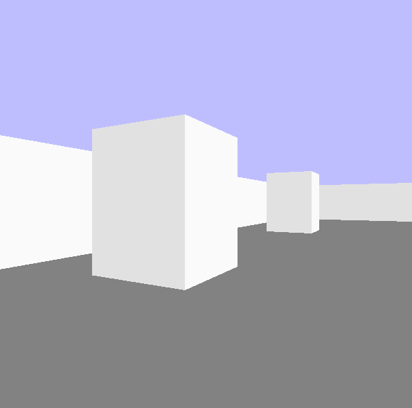
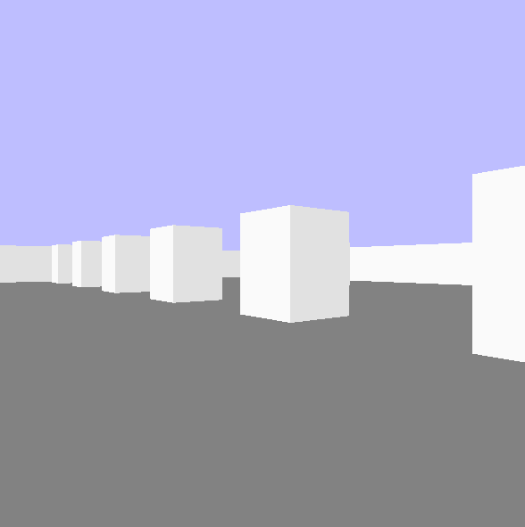

## About
This is a recreation of a raycaster that was made by [Manual do Código](https://www.youtube.com/channel/UClO5RbZy6nGl_CR7sE8nR_Q).
Link to the tutorial [here](https://www.youtube.com/watch?v=J5K8qMCB-7o&list=PLLFRf_pkM7b6rBRoTOW64NKdltCLQNpW5)

#### Images

You can edit the map on the [gamemap file](gamemap.py)

#### How to play
If pygame is not installed on your machine, execute the following command on your terminal
`pip install pygame`
Then, execute the following command to open the game
- Windows:
`python .\Play.py`
- Mac, Linux:
`python3 ./Play.py`

#### Controls
Move around using: w, a, s, d
Turn camera using: q, e
Exit the game using: esc